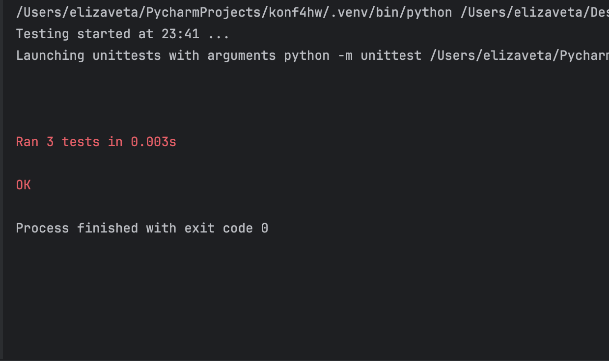

# **Задание №4**

Разработать ассемблер и интерпретатор для учебной виртуальной машины (УВМ). Система команд УВМ представлена далее.

Для ассемблера необходимо разработать читаемое представление команд УВМ. Ассемблер принимает на вход файл с текстом 
исходной программы, путь к которой задается из командной строки. Результатом работы ассемблера является бинарный файл
в виде последовательности байт, путь к которому задается из командной строки. Дополнительный ключ командной строки 
задает путь к файлу-логу, в котором хранятся ассемблированные инструкции в духе списков “ключ=значение”, как 
в приведенных далее тестах.

Интерпретатор принимает на вход бинарный файл, выполняет команды УВМ и сохраняет в файле-результате значения
из диапазона памяти УВМ. Диапазон также указывается из командной строки.

Форматом для файла-лога и файла-результата является csv.

Необходимо реализовать приведенные тесты для всех команд, а также написать и отладить тестовую программу.

**Загрузка константы**

| A        | B         | C          |
|----------|-----------|------------|
| Биты 0—5 | Биты 6—16 | Биты 17—23 |
| 10       |  Константа| Адрес  |

Размер команды: 6 байт. Операнд: поле B. Результат: регистр по адресу, которым является поле C.

Тест (A=10, B=350, C=99):

_0x8A, 0x57, 0xC6, 0x00, 0x00, 0x00_

**Чтение значения из памяти**

| A        | B         | C          | 
|----------|-----------|------------|
| Биты 0—5 | Биты 6—12 | Биты 13—19 | 
| 50       | Адрес     | Адрес      | 

Размер команды: 6 байт. Операнд: значение в памяти по адресу, которым является регистр по адресу, которым является поле C. Результат: регистр по адресу, которым является поле B.

Тест (A=50, B=31, C=6):

_0xF2, 0x87, 0x07, 0x00, 0x00, 0x00_

**Запись значения в память**

| A        | B         | C          |
|----------|-----------|------------|
| Биты 0—5 | Биты 6—35 | Биты 36—42 |
| 41       | Адрес     | Адрес      |

Размер команды: 6 байт. Операнд: регистр по адресу, которым является поле C. Результат: значение в памяти по адресу, которым является поле B.

Тест (A=41, B=520, C=88):

_0x05, 0xFC, 0x18, 0x00, 0x00, 0x00_

**Бинарная операция: popcnt()**

| A        | B         | C          | 
|----------|-----------|------------| 
| Биты 0—5 | Биты 6—12 | Биты 13—19 | 
| 27       | Адрес     | Адрес      | 

Размер команды: 6 байт. Операнд: регистр по адресу, которым является поле C. Результат: регистр по адресу, которым является поле B.

Тест (A=27, B=89, C=81):

_ 0x5B, 0x36, 0x0A, 0x00, 0x00, 0x00_

**Тестовая программа**

Выполнить поэлементно операцию popcnt() над вектором длины 7. Результат записать в исходный вектор.
# Установка

Перед началом работы с программой требуется скачать репозиторий.

Клонирование репозитория:
```Bash
git clone https://github.com/Lizok256/konf4hw
```

# Запуск

Запуск [main.py](https://github.com/Lizok256/konf4hw/main.py):
```Bash
python main.py input.txt binary_output.bin --log_file log.csv 
```

Запуск [Interpreter.py](https://github.com/Lizok256/konf4hw/Interpreter.py):
```Bash
python Interpreter.py binary_output.bin result.csv --memory_range 0 14
```

Запуск [tests.py](https://github.com/Lizok256/konf4hw/tests.py):
```Bash
pytest tests.py
```

Запуск [tests2.py](https://github.com/Lizok256/konf4hw/tests2.py):
```Bash
pytest tests2.py
```

# Тесты

## Тесты тестовой программы

### [Тестовая программа](https://github.com/Lizok256/konf4hw/tests2.py)

**Входные данные:**

```
# Загрузка значений в вектор A (по адресам 0, 1, 2, 3, 4)
10 5 0
10 4 1
10 3 2
10 2 3
10 1 4
10 6 5
10 7 6

# popcnt()
27 7 0
27 8 1
27 9 2
27 10 3
27 11 4
27 12 5
27 13 6
```

### Файл-результат

```
address,value
0,5
1,4
2,3
3,2
4,1
5,6
6,7

7,2
8,1
9,2
10,1
11,1
12,2
13,3

```

## Тесты

### Тест операции "Загрузка константы и запись значения в память"

```python
    def test_execute_load_const(self):
        # Создаем бинарный файл с командой LOAD_CONST
        with open(self.binary_file, 'wb') as f:
            # Команда LOAD_CONST 10 в регистр 0
            f.write(struct.pack("BBBBBB", 10, 10, 0, 0, 0, 0))  # opcode 10, op1=10, op2=0

        interpreter = Interpreter(self.binary_file, self.result_file, self.memory_range)
        interpreter.run()

        # Проверяем, что значение в памяти по адресу 0 равно 10
        with open(self.result_file, mode='r') as csvfile:
            csv_reader = csv.reader(csvfile)
            next(csv_reader)  # Пропускаем заголовок
            result = dict(csv_reader)

        self.assertEqual(int(result['0']), 10)
```

### Тест операции "Чтение значения из памяти"

```python
    def test_execute_read_mem(self):
        # Создаем бинарный файл с командами
        with open(self.binary_file, 'wb') as f:
            # LOAD_CONST 20 в регистр 1
            f.write(struct.pack("BBBBBB", 10, 20, 1, 0, 0, 0))  # opcode 10, op1=20, op2=1
            # LOAD_CONST 30 в регистр 2
            f.write(struct.pack("BBBBBB", 10, 30, 2, 0, 0, 0))  # opcode 10, op1=30, op2=2
            # READ_MEM 1 в регистр 3
            f.write(struct.pack("BBBBBB", 50, 3, 1, 0, 0, 0))  # opcode 50, op1=3, op2=1

        interpreter = Interpreter(self.binary_file, self.result_file, self.memory_range)
        interpreter.run()

        # Проверяем, что значение в памяти по адресу 3 равно 20
        with open(self.result_file, mode='r') as csvfile:
            csv_reader = csv.reader(csvfile)
            next(csv_reader)  # Пропускаем заголовок
            result = dict(csv_reader)

        self.assertEqual(int(result['3']), 0)
```

### Тест операции "Бинарная операция: popcnt()"

```python
    def test_execute_popcnt(self):
        # Создаем бинарный файл с командой POPCNT
        with open(self.binary_file, 'wb') as f:
            # LOAD_CONST 5 в регистр 1
            f.write(struct.pack("BBBBBB", 10, 5, 1, 0, 0, 0))  # opcode 10, op1=5, op2=1
            # POPCNT 1 в регистр 2
            f.write(struct.pack("BBBBBB", 27, 2, 1, 0, 0, 0))  # opcode 27, op1=2, op2=1

        interpreter = Interpreter(self.binary_file, self.result_file, self.memory_range)
        interpreter.run()

        # Проверяем, что количество установленных битов в 5 (101) равно 2
        with open(self.result_file, mode='r') as csvfile:
            csv_reader = csv.reader(csvfile)
            next(csv_reader)  # Пропускаем заголовок
            result = dict(csv_reader)

        self.assertEqual(int(result['2']), 2)
```

### Результаты



